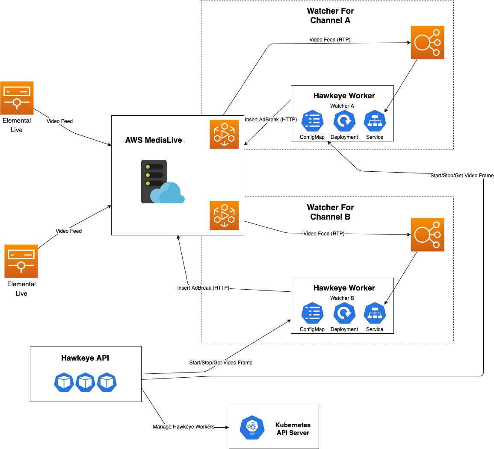

# Hawkeye
Detect images in a video stream and execute automated actions.

## Use case

Triggering Ad insertion on an AWS MediaLive Channel when a slate image is present in the video feed.



## Running locally

### Running the Worker directly with Docker
The worker can be run independently with Docker or directly on the host machine.

Build Worker:
```bash
docker build -f worker.Dockerfile -t hawkeye-worker:0.0.1 .
docker run -p 5000:5000/udp -p 3030:3030 -v /home/user/dev/hawkeye/fixtures:/local -it hawkeye-worker:0.0.1 /local/watcher.json
```

### Running the full Hawkeye application in Minikube
The full Hawkeye application consists of a REST API that manages the Workers using the Kubernetes API.

First we build the API docker image:
```bash
docker build -f api.Dockerfile -t hawkeye-api:0.0.1 .
```

## Prometheus metrics
The Worker expose metrics in the standard `/metrics` path for Prometheus to harvest.

```
$ curl http://localhost:3030/metrics
```
